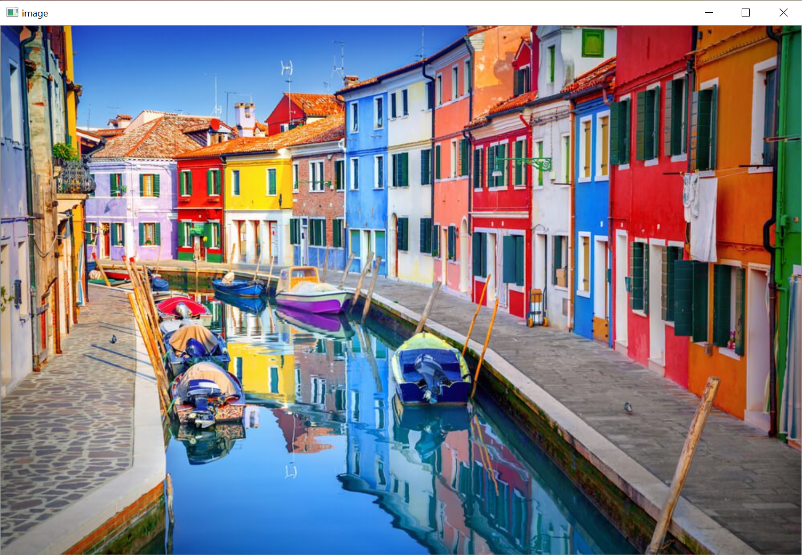
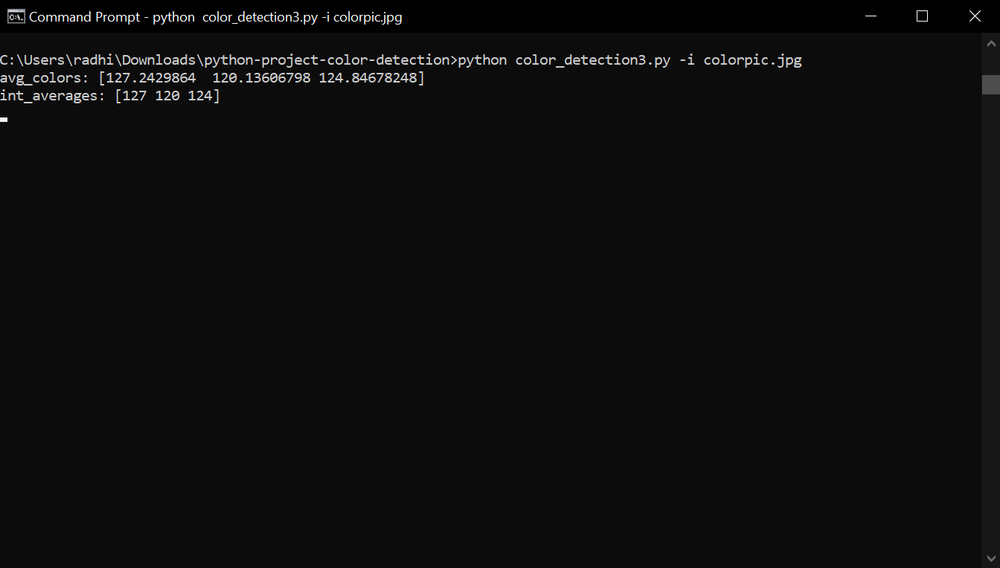
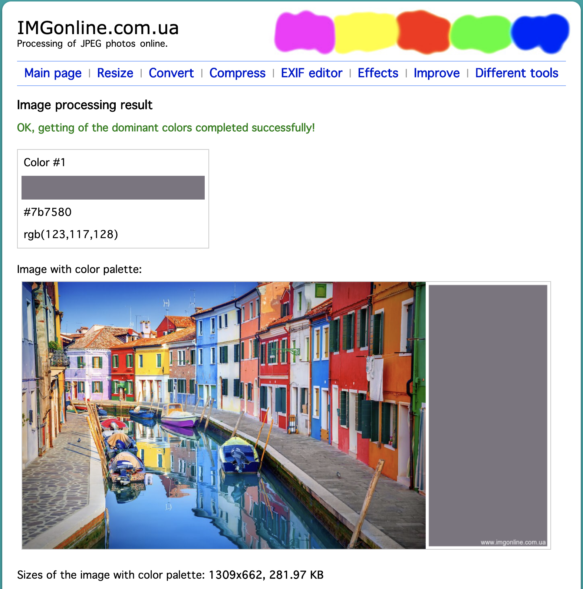

# Color Detection from an Image using OpenCV

## Color Detection
- Code: [color_detection.py](color_detection.py)
- A python application that does the following:
    - Read an Image from command line
    - Read the csv file that consists `color names` for `RGB values`
    - Open the Image in a OpenCV window
    - When a mouse event happens in the window get the x,y cordinates from the pixel
    - Calcualte the `RGB values` of the pixel and display it along with its `color name` read from the csv file

### Example with Screenshots

- Run the python script as follows:
```
python color_detection.py -i colorpic.jpg
```

- You will see the OpenCV window open up as shown below.



- **Double Click** anywhere on the image to get the `RGB values` as well as the `color name` from the image as shown.


- You can click `esc` key to quit the application.

## Get the most Dominant Color (Enhancement to the earlier application)

- Code: [dominant_color_detection.py](dominant_color_detection.py)
- The enhanced python application does the following:
    - Read an Image from command line
    - Calculate the average color of each row of the image
    - Calculate the averages of the rows
    - Create a new image of the same height/width as the original and fill its pixels with the dominant color
    - Open an OpenCV window and display the image and the newly created image side by side.

### Example with Screenshots

- Run the python script as follows:
```
python dominant_color_detection.py -i colorpic.jpg
```

- You will see the OpenCV window open up as shown below.


- You can see the Dominant color displayed at the right side of the image.

- The `RGB values` of the dominant color can be seen on the terminal.



- To verify that the application works correctly, you can verify it on <https://www.imgonline.com.ua/>



### Conclusion

As we can see, the dominant color that we got from our application is `rgb(127,120,124)` and the dominant color that we got from the website is `rgb(123,117,128)` for the same image. We can observe that both the values are approximately same, hence the performance of the application is in line with the websites!

By Radhika Patil